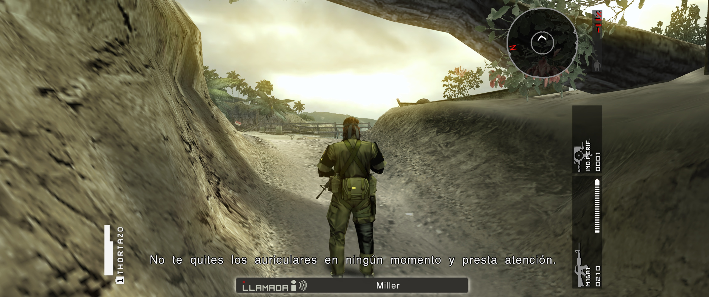
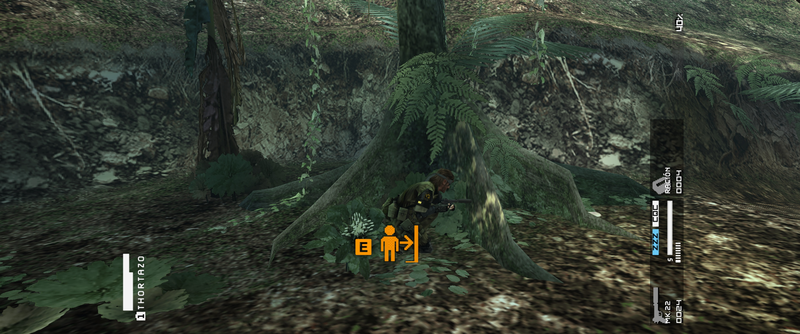
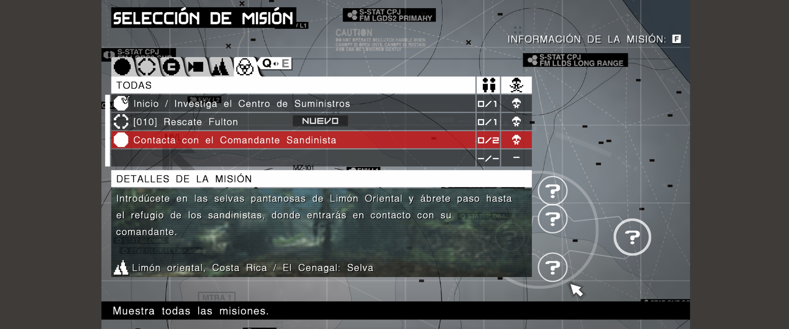

# Peace Walker UltraWide Fix

[](https://github.com/drbermejor/MGSPeaceWalkerUW-Fix/actions/workflows/build-and-test.yml)
[](https://github.com/drbermejor/MGSPeaceWalkerUW-Fix/releases/latest)

Ultrawide support for **METAL GEAR SOLID PEACE WALKER - Master Collection Version** on Windows and Linux/Proton.

The fix removes the original side bars and corrects the 3D projection to produce a Hor+ ultrawide view instead of stretching the game. A centered 16:9 HUD/menu canvas and a reversible Unity-launcher bypass are optional.

> This project remains a public release candidate. The ultrawide projection and the main centered-HUD path are working, but the limitations below are real and intentionally documented.

I maintain the implementation, tests and release packages in this repository. Technical details and the evidence required after a game update are documented in [Architecture](docs/ARCHITECTURE.md) and [Update compatibility](docs/UPDATE_COMPATIBILITY.md).



## What it fixes

- Native ultrawide output without horizontal deformation.
- Hor+ field of view that preserves the game's current vertical FOV.
- Optional centered 16:9 HUD, menus, subtitles, briefings and mission selection.
- Automatic or explicit output resolution.
- Optional, reversible Unity-launcher bypass.
- Windows and Linux/Proton setup, configuration and uninstall flows.

## Choose an installation package

Four packages are available in each release:

| Platform | Guided setup | Manual setup |
| --- | --- | --- |
| Windows | `windows.zip` | `windows-manual.zip` |
| Linux / Proton | `linux.tar.gz` | `linux-proton-manual.zip` |

The guided packages provide configuration, safe backups, launcher-bypass control
and uninstall tools. The manual packages contain only the core DLL, default INI
and a short `INSTALL.txt`; they run no scripts and make no launcher changes.

## Windows — guided setup

1. Close the game.
2. Download the latest `windows.zip` from [Releases](https://github.com/drbermejor/MGSPeaceWalkerUW-Fix/releases/latest).
3. Extract it and run `PeaceWalkerUltraWideFix-Setup.cmd`.
4. Confirm the `mgspw` folder containing `METAL GEAR SOLID PEACE WALKER.exe`.
5. Keep the recommended settings, or disable **Centered 16:9 HUD** if you prefer the interface to span the full display.
6. Start the game normally through Steam.

The installer preserves a pre-existing `winmm.dll` and restores it on uninstall. It never silently removes a DLL or launcher that changed after installation.

If automatic Steam-library detection is unsuitable, pass the game directory
explicitly:

```powershell
PeaceWalkerUltraWideFix-Setup.cmd -GameDir "D:\SteamLibrary\steamapps\common\MGS_PW\mgspw"
```

### Windows — manual setup

1. Download and extract the latest `windows-manual.zip`.
2. Open `MGS_PW\mgspw`, the folder containing
   `METAL GEAR SOLID PEACE WALKER.exe`.
3. Back up an existing `winmm.dll` before continuing; another mod may use it.
4. Copy `winmm.dll` and `PeaceWalkerUltraWideFix.ini` beside the game executable.
5. Start the game normally through Steam.

The archive's `INSTALL.txt` contains configuration and safe removal steps. The
manual package intentionally excludes the optional launcher bypass.

## Linux / Proton — guided setup

1. Close the game and Steam.
2. Download and extract the latest `linux.tar.gz`.
3. Run `./PeaceWalkerUltraWideFix-Linux-Setup.sh`.
4. Run `./PeaceWalkerUltraWideFix-Linux-Configure.sh` if you want explicit resolution, full-width UI or the launcher bypass.
5. Restart Steam and launch the game normally.

The setup detects custom Steam libraries. If detection fails:

```bash
PW_GAME_DIR="/path/to/MGS_PW/mgspw" ./PeaceWalkerUltraWideFix-Linux-Setup.sh
```

Proton must use the native proxy:

```text
WINEDLLOVERRIDES="winmm=n,b" %command%
```

The Linux installer adds this reversibly when Steam is closed. If Steam is running, it prints the exact manual action instead of editing live state.

### Linux / Proton — manual setup

1. Download and extract the latest `linux-proton-manual.zip`.
2. Open `MGS_PW/mgspw`, the folder containing
   `METAL GEAR SOLID PEACE WALKER.exe`.
3. Back up an existing `winmm.dll` before continuing; another mod may use it.
4. Copy `winmm.dll` and `PeaceWalkerUltraWideFix.ini` beside the game executable.
5. Set the Steam launch option to:

```text
WINEDLLOVERRIDES="winmm=n,b" %command%
```

6. Start the game normally through Steam.

This path uses no scripts, `chmod` or `sudo`. The archive's `INSTALL.txt` contains
configuration and safe removal steps. The optional launcher bypass remains
available in the guided package.

## Configuration

Run the installed `PeaceWalkerUltraWideFix-Configure.cmd` on Windows, or the Linux configure script. The same settings are available in `PeaceWalkerUltraWideFix.ini`:

```ini
[Fix]
Enabled=1
Width=0
Height=0
RemoveLetterboxing=1
CorrectFOV=1
CenterHUD=1

[Launcher]
BypassUnityLauncher=0
```

`Width=0` and `Height=0` use the physical primary display. Set both explicitly if automatic detection is unsuitable under Proton.

`CorrectFOV=1` keeps vertical FOV, expands the horizontal view and widens the matching CPU-side visibility boundary. The two source hooks are treated as one correction so visible ultrawide geometry is not rejected by the original 16:9 planes.

`CenterHUD=1` keeps most 2D presentation in a centered 16:9 canvas. `CenterHUD=0` leaves the interface at full output width while retaining the corrected ultrawide 3D view.

The launcher bypass reproduces the official Peace Walker launch protocol and starts the game as Steam's child process. It is off by default and can be toggled at any time; the original Unity launcher is backed up and restored conditionally.

The public default for the bypass is English. Other supported game tokens (`sp`, `fr`, `it`, `gr`, `jp`, `pt`) can be selected with `Language=` under `[Launcher]`.

## Known limitations

- Some pure or long loading illustrations can switch to full-width and appear stretched near the end of the load. Short loading screens, briefings and mission selection follow the centered presentation path.
- Full-screen 2D layers share the centered HUD canvas when `CenterHUD=1`, so side areas can remain uncovered during some transitions.
- The game still renders its 3D world internally at its original high-resolution target (1920×1088) before composing it to the selected output. This fix changes aspect and composition, not internal asset quality.
- Mouse-camera latency is present in the original port even with this patch disabled. It is not introduced by the ultrawide or HUD correction.
- The patch has exact profiles for the tested Steam Master Collection builds from before and after Steam build 25052315. An unknown executable is accepted only when every signature and structural relationship resolves consistently; otherwise the hooks fail safely.
- 3440×1440 is the primary visually verified ultrawide mode. The 32:9 horizontal-visibility path has been reproduced with a live aspect simulation, but physical 5120×1440 and additional modes still need broader public testing.

## Game-update compatibility

Known Steam builds use exact PE profiles and independently verify every code target. If a future update only moves otherwise unchanged code and data, the patch can recover the targets from complete signatures in memory. Every locator must be unique, both viewport call sites must resolve to the same wrapper, and the derived data addresses must stay inside the expected PE sections. Missing, ambiguous or inconsistent results are rejected.

This improves resilience to address-only updates; it is not a promise that arbitrary engine changes will remain compatible. A change in behavior, instruction structure or data layout still requires analysis and in-game validation. See [Update compatibility](docs/UPDATE_COMPATIBILITY.md) for the exact boundary and [Horizontal visibility correction](docs/HORIZONTAL_VISIBILITY.md) for the culling diagnosis and formula.





## Troubleshooting

- Check `PeaceWalkerUltraWideFix.log` beside the game executable.
- Confirm the DLL and INI are beside `METAL GEAR SOLID PEACE WALKER.exe`, not one directory above it.
- On Proton, confirm the `WINEDLLOVERRIDES` launch option.
- Disable `CenterHUD` to distinguish a HUD classification issue from the base ultrawide correction.
- Rerun setup after Steam verifies or updates game files.

When reporting a problem, include the log, resolution, OS/Proton version, whether `CenterHUD` and the launcher bypass are enabled, and a screenshot if the issue is visual.

## Build

Windows (MSVC + Ninja):

```powershell
cmake -S . -B build -G Ninja -DCMAKE_BUILD_TYPE=Release
cmake --build build
ctest --test-dir build --output-on-failure
```

Linux cross-build (MinGW-w64):

```bash
cmake -S . -B build -G Ninja \
  -DCMAKE_TOOLCHAIN_FILE=cmake/mingw-w64-x86_64.cmake \
  -DCMAKE_BUILD_TYPE=Release
cmake --build build
```

Release archives are generated from CI-tested binaries with `scripts/package_release.py` and include SHA-256 checksums.

## Antivirus and release trust

This patch is a `winmm.dll` proxy that allocates small executable code islands
and installs validated in-process detours. Those legitimate runtime-patching
behaviors can trigger generic heuristic detections. The code does not download
payloads, create persistence or modify another process.

Keep antivirus protection enabled. Download only from this repository, verify
`SHA256SUMS.txt`, and report the exact release, file hash and detection name if
the latest build is blocked. Do not add a broad antivirus exclusion.

Release assets are built in GitHub Actions, which generates GitHub
build-provenance attestations in addition to checksums. See
[Antivirus and release trust](docs/ANTIVIRUS.md) for the measured Defender case,
verification commands and the official false-positive process.

For contribution and validation requirements, see [CONTRIBUTING.md](CONTRIBUTING.md).

## License

[MIT](LICENSE)
