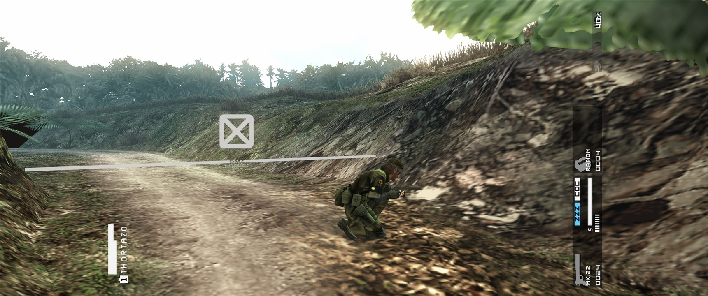
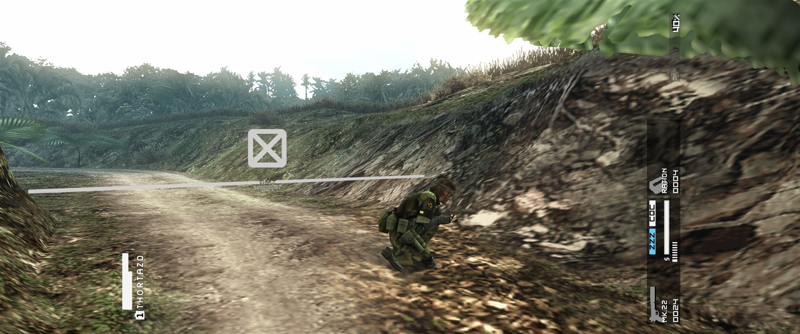

# Horizontal visibility correction

This note records why the rendered Hor+ projection also needs a matching CPU-side visibility correction. It contains only findings that were reproduced against the maintained Steam executables and in the running game.

## Symptom

At very wide aspect ratios, terrain or other geometry near a lateral edge can disappear as the camera moves. The missing area can look like a black polygon or an opening in the level. The effect is intermittent because it depends on the camera angle and the object's relation to the original 16:9 visibility boundary.

This is not evidence of missing level geometry. The affected terrain reappears when the camera moves back inside the original boundary, and stopped disappearing during traversal when the horizontal visibility boundary was widened with the projection left unchanged.

## Static result

The projection builder returns before the game creates six CPU-side visibility planes. The relevant camera fields are:

```text
camera + 0x250 = height / width
camera + 0x254 = native horizontal projection coefficient (m0)
```

The original plane builder seeds the left and right planes from `+0x254`, while the top and bottom planes use the original coefficient and `+0x250`. The relationship to the live vertical projection coefficient is:

```text
m5 = camera[0x254] / camera[0x250]
```

For an output aspect `A`, the matching horizontal coefficient is therefore:

```text
horizontal = m5 / A
           = (camera[0x254] / camera[0x250]) / A
```

The hook replaces only the positive and negative left/right seeds. It reproduces the original top/bottom stores unchanged, preserving vertical FOV and vertical visibility.

## Live discrimination

A fixed-camera test used the production candidate at a real 3440x1440 output. The projection, scene and camera remained unchanged. Only the inverse-aspect constant used by the live horizontal visibility island was switched:

```text
original 9/16 -> corrected 1440/3440
0.5625        -> 0.4186046
```

With the original value, a black triangular opening replaced terrain at the left edge. Changing only the visibility value restored the missing terrain in the next capture without moving the camera. In the leftmost 10% of the aligned 3440x1440 frames, 5.03% of pixels changed by more than 30 summed RGB levels; the mean summed difference was 7.75. The middle differences are ordinary character animation, while the lateral polygon is the visibility result.

Original horizontal visibility at 3440x1440:



Corrected horizontal visibility with the same camera and projection:



An earlier diagnostic also separated physical output size from angular coverage: physical output remained 3440x1440 while projection and visibility calculations used 5120x1440 (32:9). Its F7 hotkey changed only the horizontal visibility seeds. During repeated traversal of the same jungle route, the original seeds produced intermittent lateral holes; the corrected seeds stopped that reproduction; returning to the original seeds reproduced the artifact class.

One still-camera view during development produced no lateral difference between the two states because it contained no object between the original and widened boundaries. That null control is retained in the local research evidence and prevents a lack of change in an unsuitable view from being misreported as a refutation.

The diagnostic aspect override and hotkey are not present in the production candidate. A second run used the real 3440x1440 output aspect, loaded the exact Steam profile, resolved all signatures, installed visibility before projection, and completed an in-game visual pass without the observed holes.

## Targeting and failure behavior

The locator is a 45-byte instruction window around the visibility-plane seed block. It matched exactly once in each locally held unpacked executable:

| Steam executable | Signature RVA | Hook RVA |
| --- | ---: | ---: |
| build before 25052315 | `0x8ed54` | `0x8ed5a` |
| build 25052315 | `0x8eea4` | `0x8eeaa` |

Retail or unpacked executables are not stored or distributed with the project.

The resolver requires a unique match and a complete set of consistent targets. At runtime the visibility hook is installed before the projection hook. If visibility cannot be installed, `CorrectFOV` remains unapplied rather than allowing a wide projection with a narrow rejection boundary.

## Validation boundary

The calculation is resolution-independent, the fixed-camera 3440x1440 comparison is positive and the 32:9 angular case was reproduced locally. Physical 5120x1440 output still benefits from independent user validation across more stages, especially scenes with large geometry near both lateral edges. This is an acceptance boundary, not an unresolved mechanism.
